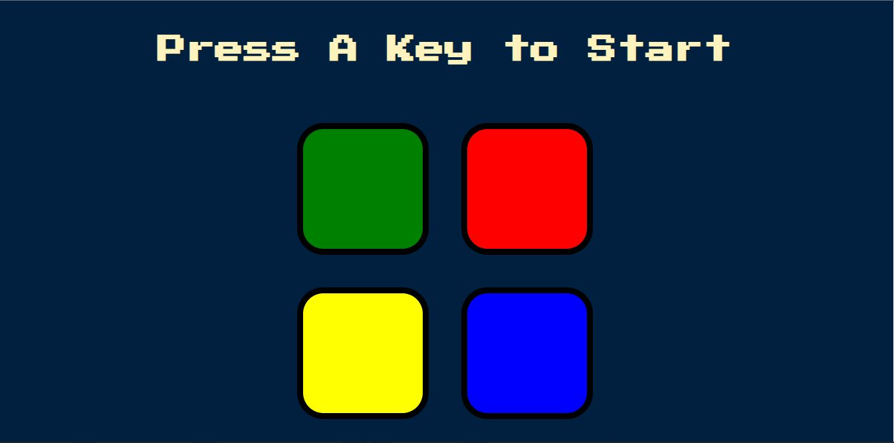

# Simon Game



A fun memory game that I got from [udemy](https://udemy.com) course. Work hard for this logic couse don't have any experience in Javascript 😁😁 .

## Instruction :

Press any key to start the game. Memorize the sequence and tap the appropriate button to advance to the next level. Level will keep rising till you make a mistake. It's time to boast your memory powers!!

## What I learn

I learn lot of code sequence here, this code is a one of hard part.

```javascript
function checkAnswer(currentLevel) {
  if (gamePattern[currentLevel] === userClickedPattern[currentLevel]) {
    if (gamePattern.length === userClickedPattern.length) {
      setTimeout(function () {
        nextSequence();
      }, 1000);
    }
  } else {
    $('body').addClass('game-over');
    setTimeout(function () {
      $('body').removeClass('game-over');
    }, 200);
    gameOver();
    $('#level-title').text('Game Over, Press Any Key to Restart');
    startOver();
  }
}
```

## Contributing

Pull requests are welcome. For major changes, please open an issue first to discuss what you would like to change.
